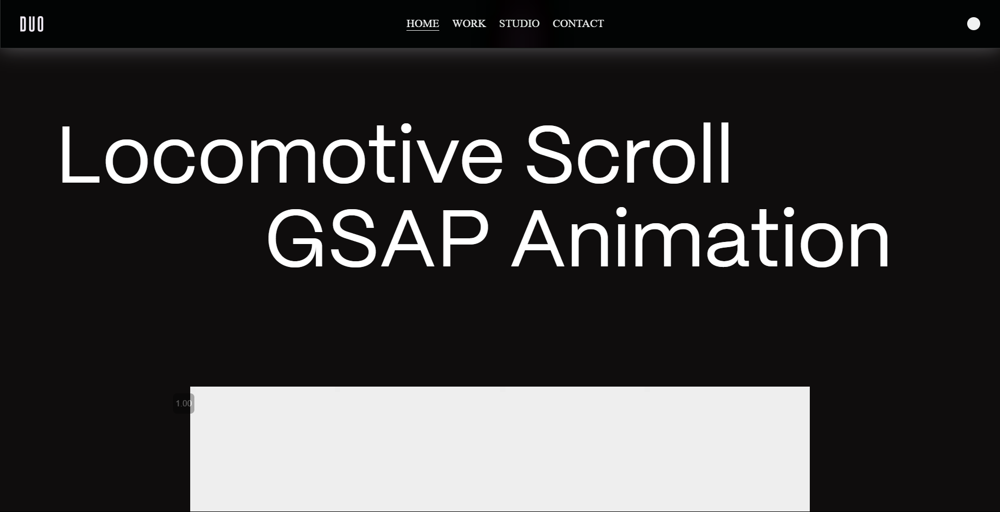
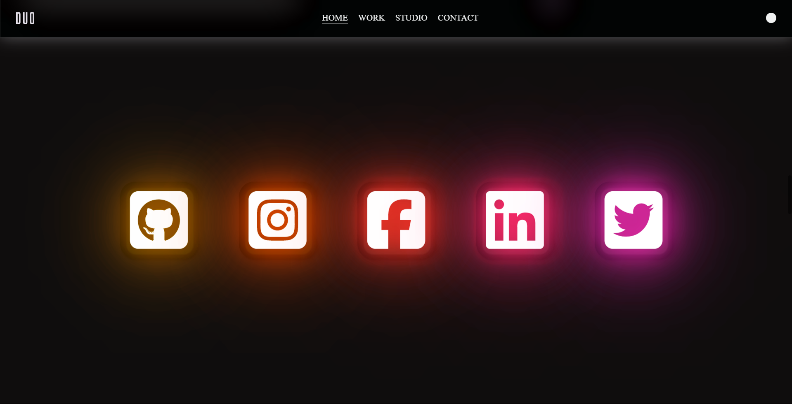
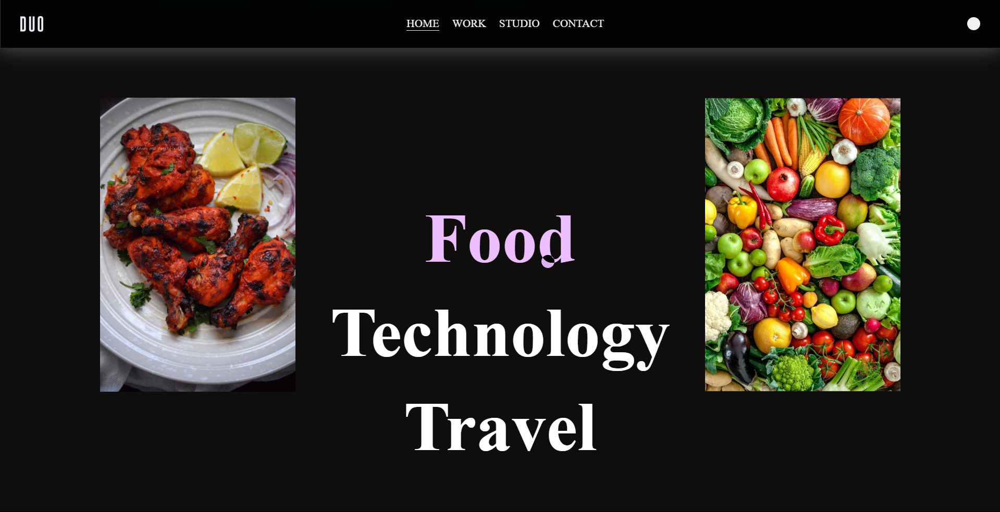
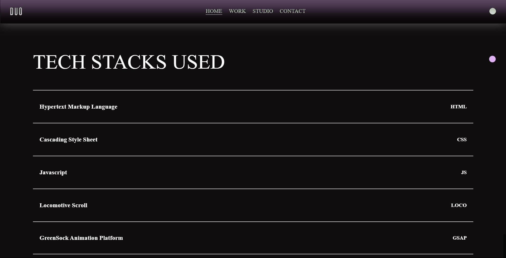

# Interactive Animation

A frontend website showcasing advanced animation techniques and smooth scrolling effects, designed to highlight exceptional user interface (UI) and user experience (UX).

[Live Demo](https://locomotive-gsap.netlify.app/)

---

## Overview
This project demonstrates:
- Creative use of animations to captivate users.
- Smooth scrolling effects for enhanced navigation and interaction.
- Horizontal scrolling sections to create dynamic content flow.

---

## Features
- **Smooth Scrolling:** Implemented using Locomotive Scroll for seamless navigation.
- **Scroll-Triggered Animations:** Leveraged GSAP ScrollTrigger for interactive animations.
- **Horizontal Scrolling:** Engaging horizontal scrolling effects within the page.
- **Highly Interactive UI/UX:** Designed to encourage user engagement and exploration.

---

## Screenshots
### Animated Sections:





---

## Technologies Used

### Frontend
- **HTML5:** Structured content.
- **CSS3:** Advanced styling and layouts.
- **JavaScript (ES6):** Dynamic and interactive features.
- **GSAP:** Scroll-triggered animations and transitions.
- **Locomotive Scroll:** Smooth scrolling experience.

### Hosting
- Hosted on Netlify: [Live Demo](https://locomotive-gsap.netlify.app/)

---

## Installation

### Steps
1. Clone the repository:
   ```bash
   git clone https://github.com/your-username/animation-portfolio.git
   ```

2. Navigate to the project directory:
   ```bash
   cd animation-portfolio
   ```

3. Open the `index.html` file in your browser:
   ```bash
   open index.html
   ```

---

## How It Works
1. **Smooth Scrolling:** Locomotive Scroll ensures a fluid navigation experience.
2. **Scroll Animations:** GSAP ScrollTrigger triggers animations based on scroll positions.
3. **Horizontal Scrolling:** Custom animations create visually appealing horizontal scrolling sections.

---

## Future Improvements
- Add 3D animation effects for more immersive interactions.
- Integrate a content management system for dynamic updates.
- Implement a light/dark theme toggle for better accessibility.

---

## Contribution
Contributions are welcome! Feel free to fork the repository and submit a pull request.

---

## Contact
For queries or feedback, please contact [Shubham](mailto:shubhamjaishu@gmail.com).
